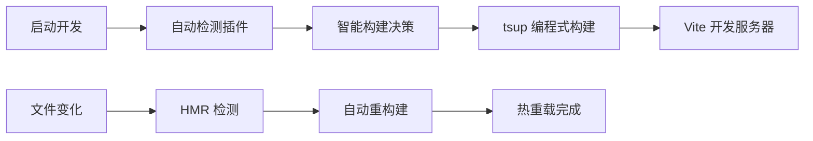

# 🎮 TypeScript RPGMV 插件开发环境

## 🎯 项目改进概述

本项目已完成从 JavaScript 到 TypeScript 的 RPGMV 插件开发环境升级，实现了现代化的类型安全插件开发流程。

## ✨ 主要改进

### 1. 类型安全优化

- ✅ 复用现有的完整 RPGMV 类型声明
- ✅ 优化 `global.d.ts`，替换 `any` 类型为具体类型
- ✅ 完整的 TypeScript 编译时类型检查

### 2. 现代化开发流程

- ✅ TypeScript 源码：`src/rpgmv-plugins/`
- ✅ 自动构建输出：`drill-project/js/plugins/`
- ✅ 配置化构建：`tsup.config.ts`
- ✅ 热重载开发模式

### 3. 增强的开发体验

```bash
# 🚀 零配置开发启动（自动构建插件）
pnpm run dev:drill

# 🔄 监听模式构建插件
pnpm run build:rpgmv-plugins:watch

# 🔨 手动构建所有插件
pnpm run build:rpgmv-plugins
```

## 📁 文件结构对比

### 之前 (JavaScript)

```plain
drill-project/js/plugins/
└── VueBridge.js  ❌ 手动编写JS，缺乏类型安全
```

### 现在 (TypeScript)

```plain
src/rpgmv-plugins/
└── VueBridge.ts  ✅ TypeScript源码，类型安全

drill-project/js/plugins/
└── VueBridge.js  ✅ 自动编译生成，ES5兼容
```

## 🔧 技术栈

| 技术       | 用途         | 版本       |
| ---------- | ------------ | ---------- |
| TypeScript | 插件源码语言 | 最新       |
| tsup       | 插件构建工具 | v8.5.0     |
| Vite       | 自动构建集成 | v5.4.1     |
| ES5        | 目标兼容性   | RPGMV 兼容 |
| IIFE       | 输出格式     | 插件标准   |

## 🚀 零配置自动构建系统

### 🎯 新特性亮点

项目现已集成 **Vite 自动构建插件**，实现了以下突破性改进：



#### ✨ 核心优势

- **🔥 零启动成本**：`pnpm run dev:drill` 一键启动
- **🧠 智能构建**：仅在需要时构建，避免重复操作
- **⚡ 热重载支持**：TypeScript 文件变化自动重新构建
- **🛡️ 错误处理**：友好的构建失败提示
- **📦 生产就绪**：构建命令同样自动处理

### 📋 自动构建工作流程

#### 开发模式 (Development)

1. 运行 `pnpm run dev:drill`
2. Vite 插件检查插件是否需要构建
3. 调用 tsup 的 `build()` 函数进行构建
4. 启动 Vite 开发服务器
5. 监听 `src/rpgmv-plugins/` 文件变化并自动重新构建

#### 生产模式 (Production)

1. 运行 `pnpm run build:drill`
2. 构建前自动处理 RPGMV 插件
3. 继续 Vue 应用的生产构建

## 🎯 开发流程

### 开发新插件（🆕 简化流程）

1. 在 `src/rpgmv-plugins/` 创建 `.ts` 文件
2. 在 `tsup.config.ts` 添加入口配置
3. **直接运行 `pnpm run dev:drill`** ✨ (自动构建!)
4. 在 `index.html` 引用生成的 `.js` 文件

### 修改现有插件（🆕 热重载）

1. 编辑 `src/rpgmv-plugins/VueBridge.ts`
2. **保存文件即可** ✨ (自动重新构建!)
3. 浏览器自动刷新查看效果

## 📊 构建配置特性

### 输出优化

- **格式**: IIFE (立即执行函数)
- **目标**: ES5 (RPGMV 兼容)
- **压缩**: 可配置 (当前关闭保持可读性)
- **Source Maps**: 关闭

### 外部依赖

自动排除 RPGMV 全局对象，避免重复打包：

- `$gameVariables`, `$gameSwitches`, `$gameMessage`
- `SceneManager`, `AudioManager`
- `Scene_Boot`, `Game_Actor`

### 构建横幅

自动添加构建信息：

```javascript
//=============================================================================
// VueBridge.js - 由TypeScript编译生成
// Vue与RPGMV双向通信桥接插件
// 编译时间: 2025-07-31T09:40:10.358Z
//=============================================================================
```

## 🔍 类型安全示例

### 之前 (any 类型)

```typescript
// ❌ 缺乏类型安全
$gameVariables: any;
$gameSwitches: any;
SceneManager: any;
```

### 现在 (具体类型)

```typescript
// ✅ 完整类型安全
$gameVariables: Game_Variables;
$gameSwitches: Game_Switches;
SceneManager: SceneManagerStatic;

// ✅ 类型安全的API调用
$gameVariables.setValue(1, "Hello World");
$gameSwitches.setValue(1, true);

const audio: MV.AudioParameters = {
	name: "Decision1",
	volume: 90,
	pitch: 100,
	pan: 0,
	pos: 0,
};
AudioManager.playSe(audio);
```

## 📖 相关文档

- [TypeScript 插件开发指南](./docs/typescript-plugin-development.md) - 详细开发指南
- [Vue 与 RPGMV 双向通信系统](./docs/vue-rpgmv-communication.md) - 通信系统文档

## 🎉 使用建议

### 推荐开发流程（🆕 极简版）

```bash
# 🚀 一键启动 - 自动构建插件并启动开发服务器
pnpm run dev:drill

# 就这么简单！无需额外配置或脚本 ✨
```

### 高级开发模式

```bash
# 如果需要单独监听插件变化（一般不需要）
pnpm run build:rpgmv-plugins:watch
```

### 生产环境构建

```bash
# 生产构建 - 自动构建插件然后构建Vue应用
pnpm run build:drill
```

## 🚀 立即开始

运行以下命令启动现代化的 TypeScript 开发环境：

```bash
cd apps/drill
pnpm run dev:drill
```

**就这一条命令！** 🎯

现在你可以享受：

- ✅ 类型安全的 RPGMV 插件开发
- ✅ 自动构建和热重载
- ✅ 零配置的开发体验
- ✅ 现代化的工具链

🎮✨ **开发从未如此简单！**
