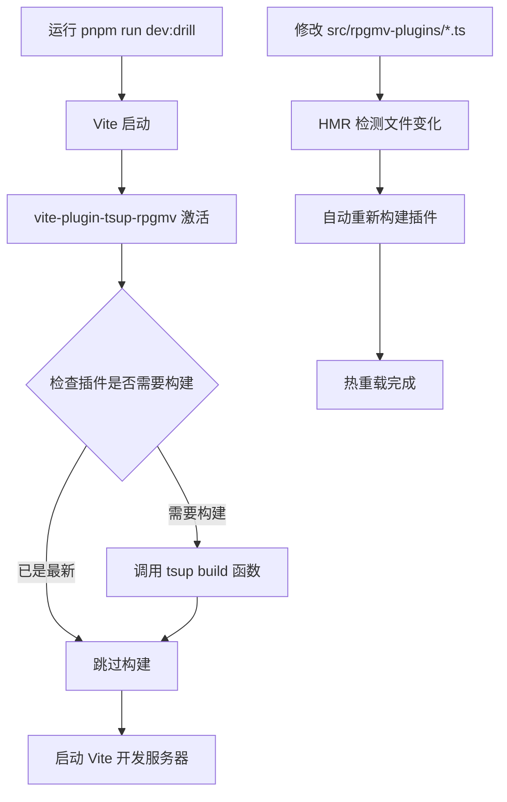

# TypeScript RPGMV 插件开发指南

## 概述

本项目已经配置好了完整的 TypeScript 开发环境，用于开发 RPGMV 插件。所有插件都在 `src/rpgmv-plugins/` 目录下使用 TypeScript 编写，然后通过 `tsup` 工具自动编译为 ES5 兼容的 JavaScript 文件，输出到 `drill-project/js/plugins/` 目录。

## 目录结构

```plain
apps/drill/
├── src/
│   ├── rpgmv-plugins/           # TypeScript插件源码目录
│   │   └── VueBridge.ts         # Vue通信桥接插件
│   └── types/
│       ├── global.d.ts          # 全局类型声明(已优化)
│       ├── rpg_core.d.ts        # RPGMV核心类型
│       ├── rpg_objects.d.ts     # RPGMV对象类型
│       ├── rpg_managers.d.ts    # RPGMV管理器类型
│       └── ...                  # 其他RPGMV类型文件
├── drill-project/
│   └── js/plugins/              # 编译后的JS插件输出目录
│       └── VueBridge.js         # 编译生成的插件文件
├── tsup.config.ts               # 插件构建配置
└── package.json                 # 包含构建脚本
```

## 开发流程

### 1. 创建新插件

在 `src/rpgmv-plugins/` 目录下创建新的 TypeScript 文件：

```typescript
// src/rpgmv-plugins/YourPlugin.ts
interface YourPluginStatic {
	version: string;
	init(): void;
	// 添加你的方法定义
}

const YourPlugin: YourPluginStatic = {
	version: "1.0.0",

	init(): void {
		console.log("YourPlugin initializing...");
		// 插件初始化逻辑
	},

	// 实现你的方法
};

// IIFE wrapper for plugin
(() => {
	"use strict";

	// 插件初始化逻辑
	const _Scene_Boot_start = Scene_Boot.prototype.start;
	Scene_Boot.prototype.start = function () {
		_Scene_Boot_start.call(this);

		setTimeout(() => {
			YourPlugin.init();
		}, 1000);
	};

	// 暴露给全局
	window.YourPlugin = YourPlugin;

	console.log("YourPlugin loaded (TypeScript version)");
})();
```

### 2. 更新构建配置

在 `tsup.config.ts` 中添加新插件的入口：

```typescript
export default defineConfig({
	entry: {
		VueBridge: "./src/rpgmv-plugins/VueBridge.ts",
		YourPlugin: "./src/rpgmv-plugins/YourPlugin.ts", // 添加新插件
	},
	// ... 其他配置
});
```

### 3. 构建插件

使用以下命令构建插件：

```bash
# 构建所有插件
pnpm run build:rpgmv-plugins

# 监听模式构建(开发时使用)
pnpm run build:rpgmv-plugins:watch
```

### 4. 在 HTML 中引用

在 `drill-project/index.html` 中添加插件引用：

```html
<!-- 在其他插件加载之后添加 -->
<script src="./js/plugins/YourPlugin.js"></script>
```

## 可用的脚本命令

```bash
# 基础开发命令（🚀 推荐使用）
pnpm run dev:drill                    # 启动vite开发服务器（自动构建插件）
pnpm run build:rpgmv-plugins          # 手动构建所有RPGMV插件
pnpm run build:rpgmv-plugins:watch    # 监听模式构建插件

# 🎯 新特性：自动构建集成
# 现在所有 pnpm run dev:* 和 pnpm run build:* 命令都会
# 通过 Vite 插件自动构建 RPGMV 插件，无需额外脚本！
```

## 🔄 自动构建系统

### Vite 插件集成

项目已集成 **自动构建系统**，通过自定义的 Vite 插件在开发服务器启动前和生产构建前自动处理 RPGMV 插件的构建：

#### 工作原理



#### 智能构建策略

- **条件构建**：仅在输出文件不存在时构建
- **热重载支持**：自动检测 `src/rpgmv-plugins/` 目录变化
- **构建缓存**：避免重复构建已最新的插件
- **详细日志**：可选的构建过程详细输出

#### 配置选项

Vite 插件位于 `plugins/vite-plugin-tsup-rpgmv.ts`，支持以下配置：

```typescript
// vite.config.ts
vitePluginTsupRpgmv({
	verbose: true, // 启用详细日志
	forceRebuild: false, // 强制重新构建
	outputPaths: [
		// 检查的输出文件路径
		"drill-project/js/plugins/VueBridge.js",
	],
});
```

### 优势特性

✅ **零配置启动**：直接运行 `pnpm run dev:drill` 即可  
✅ **自动依赖检测**：智能判断是否需要重新构建  
✅ **开发体验优化**：文件变化时自动热重载  
✅ **错误处理**：构建失败时的友好错误提示  
✅ **生产就绪**：生产构建时同样自动处理插件

## 类型安全

### 使用现有的 RPGMV 类型

项目已经包含了完整的 RPGMV 类型声明，你可以直接使用：

```typescript
// 直接使用类型化的全局对象
$gameVariables.setValue(1, "Hello World");
$gameSwitches.setValue(1, true);
$gameMessage.add("消息内容");

// 使用AudioManager播放音效
const audio: MV.AudioParameters = {
	name: "Decision1",
	volume: 90,
	pitch: 100,
	pan: 0,
	pos: 0,
};
AudioManager.playSe(audio);

// 场景切换
SceneManager.goto(Scene_Map);
```

### 访问受保护的属性

对于一些受保护的属性，使用类型断言：

```typescript
// 访问玩家数据
const actor = $gameParty.leader() as any;
const playerName = actor._name;
const playerLevel = actor._level;

// 访问地图ID
const mapId = ($gameMap as any)._mapId;
```

## 调试技巧

### 1. 开发时监听模式

使用监听模式自动重新构建：

```bash
pnpm run build:rpgmv-plugins:watch
```

### 2. 控制台调试

在插件中添加详细的日志：

```typescript
console.log("插件状态:", {
	initialized: this.initialized,
	version: this.version,
});
```

### 3. 错误处理

为插件方法添加错误处理：

```typescript
try {
	// 插件逻辑
} catch (error) {
	console.error("插件错误:", error);
}
```

## 最佳实践

### 1. 插件结构

- 使用接口定义插件的公共 API
- 将插件包装在 IIFE 中避免全局污染
- 提供版本号和初始化状态

### 2. 类型安全

- 充分利用现有的 RPGMV 类型声明
- 对不确定的类型使用类型断言
- 为自定义数据结构创建接口

### 3. 错误处理

- 在关键操作前检查对象是否存在
- 提供详细的错误日志
- 优雅地处理异常情况

### 4. 性能考虑

- 避免在游戏循环中执行重复的重型操作
- 使用防抖/节流来控制频繁触发的事件
- 及时清理事件监听器

## 构建产物

### 输出格式

- **格式**: IIFE (立即执行函数表达式)
- **目标**: ES5 (RPGMV 兼容)
- **输出目录**: `drill-project/js/plugins/`
- **文件扩展名**: `.js`

### 构建特性

- ✅ TypeScript 编译
- ✅ ES5 兼容性转换
- ✅ 自动依赖处理
- ✅ 源码压缩 (可配置)
- ✅ 构建时间戳
- ✅ 错误检查
- ✅ 监听模式

### 外部依赖

以下 RPGMV 全局对象被配置为外部依赖，不会被打包进插件：

- `$gameVariables`, `$gameSwitches`, `$gameMessage`
- `$gameParty`, `$gamePlayer`, `$gameMap`
- `SceneManager`, `AudioManager`
- `Scene_Boot`, `Game_Actor`

## 故障排除

### 常见问题

1. **类型错误**: 检查是否正确引用了类型声明文件
2. **构建失败**: 查看终端输出的具体错误信息
3. **插件不工作**: 确认 HTML 中正确引用了编译后的 JS 文件
4. **访问权限错误**: 对受保护属性使用类型断言

### 检查清单

- [ ] TypeScript 文件位于正确的目录 (`src/rpgmv-plugins/`)
- [ ] tsup.config.ts 中添加了插件入口配置
- [ ] 插件编译成功并生成了 JS 文件
- [ ] HTML 中正确引用了编译后的插件
- [ ] 浏览器控制台无 TypeScript 相关错误

## 示例项目

本项目的 `VueBridge.ts` 是一个完整的示例，展示了：

- 完整的插件结构
- Vue 与 RPGMV 的双向通信
- 类型安全的 API 使用
- 错误处理机制
- 事件监听和数据同步

你可以参考它来开发自己的插件。
